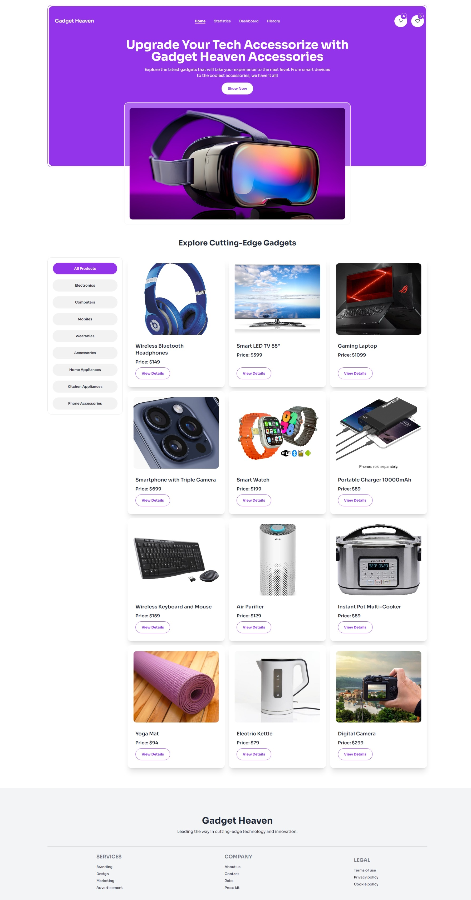
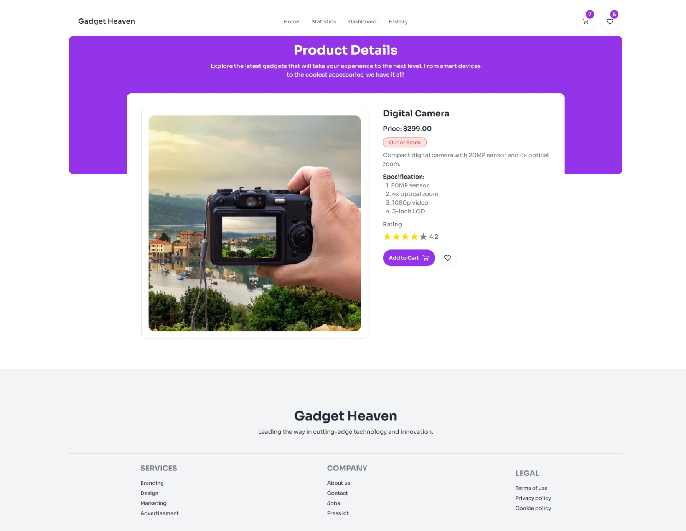
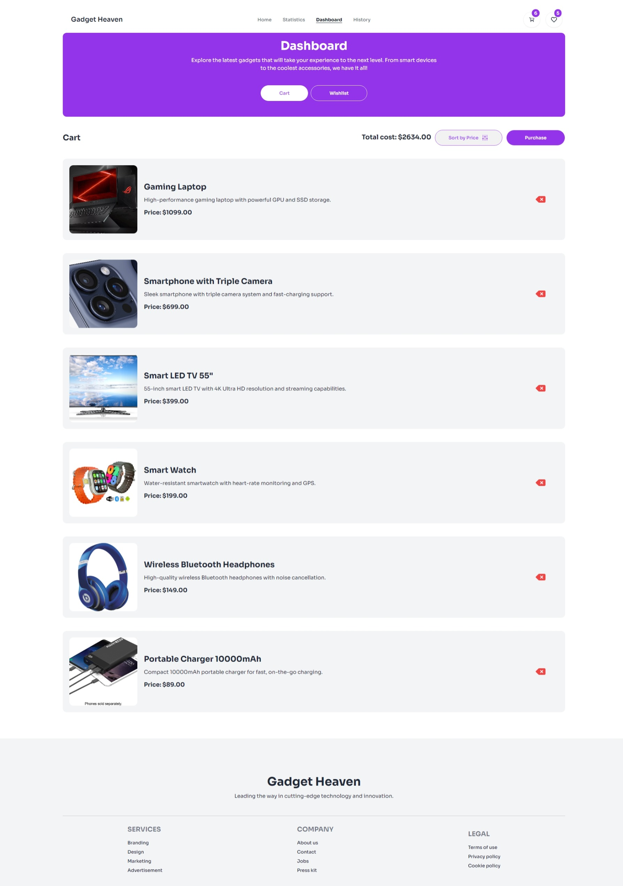
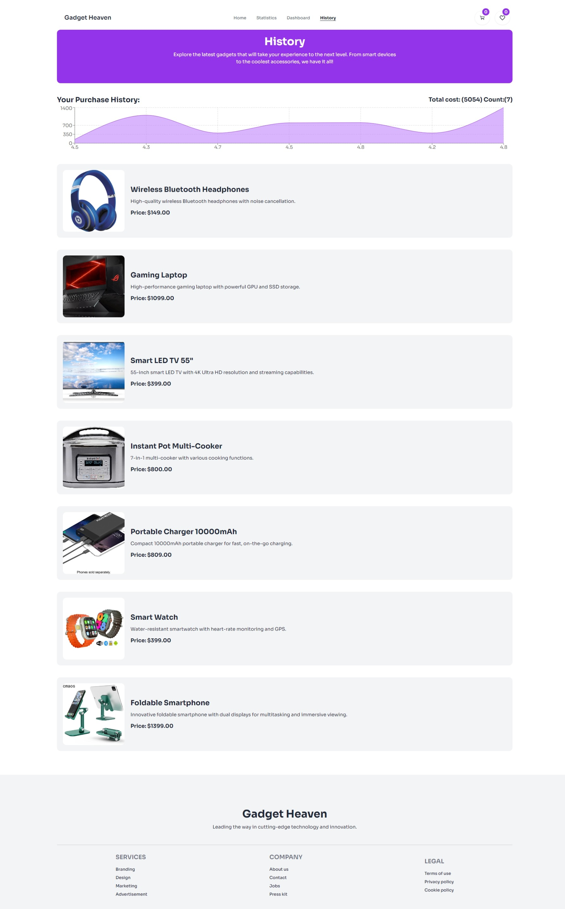

# Title: GadgetHeaven E-Commerce a gadget-buying website

## Description:

GadgetHeaven is a gadget-buying website that allows users to browse and purchase gadgets. The website has a clean and modern design, with a focus on user experience. It also has a secure payment gateway to ensure that users' payment information is protected.

## Features:

- User can see a list of all the gadgets available for purchase
- User can search for specific gadgets by name or category
- User can view detailed information about a specific gadget
- User can add a gadget to their cart
- User can view their cart and see the total cost of their purchase
- User can add wishlist to their wishlist
- User can view their wishlist and see the total cost of their purchase
- User can checkout and complete the purchase

## Technologies Used:

- HTML
- CSS
- JavaScript
- React
- Tailwind CSS
- Context API
- Fetch API
- Toastify React

## Live Demo:

### https://batch10-assignment-8.netlify.app

### https://batch10-assignment-8.surge.sh

## Screenshots:

